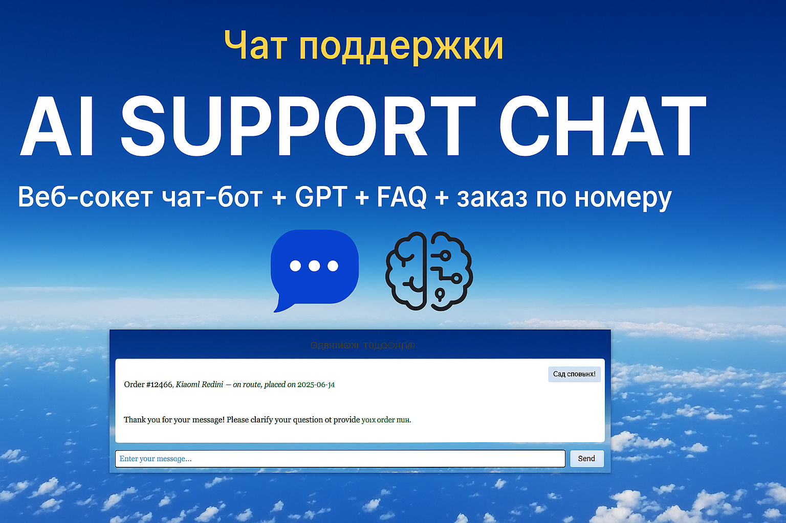

# 🤖 Онлайн-чат поддержки / AI Customer Support Chatbot

Демо-проект чат-бота поддержки с использованием **FastAPI**, **WebSocket** и **OpenAI GPT**.  
Интерфейс в браузере, ответы на частые вопросы и поддержка заказов по номеру.

---


## 🔧 Возможности / Features

- 📦 Поиск информации по заказу
- 💬 Ответы на типовые вопросы (FAQ)
- 🌐 Поддержка русского и английского языка
- ⚡ Веб-сокеты (WebSocket) для реального времени
- 🤖 Fallback на GPT-ответ (опционально)
- 🧩 Простая архитектура (backend + frontend)

---

## 🚀 Запуск проекта / Getting Started
- Установите зависимости / Install dependencies:
pip install -r requirements.txt
- Настройте файл .env / Configure .env:
Скопируйте пример и вставьте ваш OpenAI API ключ
Открой .env и укажи свой ключ
"OPENAI_API_KEY=sk-ваш_ключ_сюда"
- Запустите сервер / Run backend server:
python run_server.py
Сервер работает на: http://localhost:8000
- Запустите frontend / Start frontend:
cd frontend
python -m http.server 8080

---

## 🗂️ Структура проекта / Project Structure
ai-support-chat/
├── backend/
│ ├── main.py # WebSocket-сервер FastAPI
│ ├── ai_logic.py # Логика: GPT, FAQ, заказы
│ └── orders.json # Фейковая база заказов
├── frontend/
│ ├── index.html # Интерфейс чата
│ ├── chat.js # WebSocket логика
│ └── style.css # (опционально)
├── run_server.py # Запуск сервера с .env
├── .env.example # Пример переменных окружения
├── requirements.txt # Зависимости проекта
└── README.md # Этот файл

### Клонируйте репозиторий / Clone this repo:

```bash
git clone https://github.com/Derevovpole/ai-support-chat.git
cd ai-support-chat

####🧾 Лицензия / License
MIT License © 2025 Derevovpole

📫 Контакты / Contacts
📧 roman.chervyakov420@gmail.com
